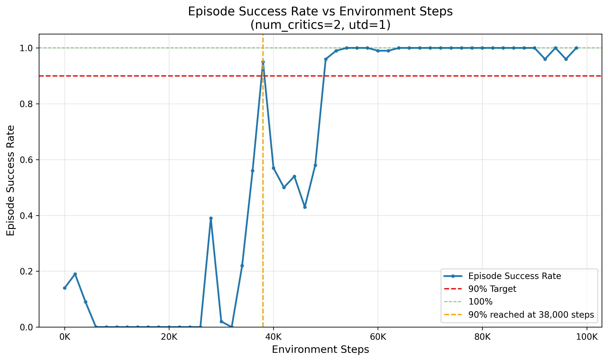
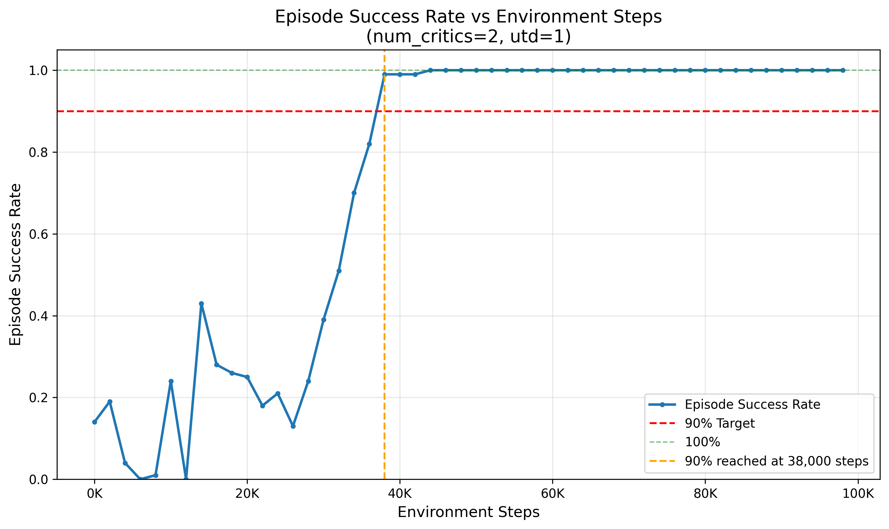

# XCS224R Assignment 2

---

## Problem 1: Reward Function Impact

### Part 1a

Did extensive exploration, didn't reach an ideal result. Seems to be MUJOCO version issue in VM. Don't have addtional time for it. 
My current result is $w_0 = 2, w_1 = 2, w_2 = 0.05, w_3 = -0.1$
This tuning can at least make the goal move in the same way as shown in the demo video

---

### Part 1b

#### Part 1bi

**Successful Manipulation** ($w_0=20, w_1=3, w_2=10, w_3=0.1$, Horizon=2.5)

The agent demonstrates fluid and successful manipulation because high weights on cube positon and orientation force the agent to prioritize the task while a low control penality allows the fingers to move quickly to make necessary changes. The velocity penalty also ensures the sube doesn't fly away due to high speed. Meanwhile, the long 2.5s horizon allows for deep foresight in planning finger trajectories.

---

#### Part 1bii

**Stiff Behavior** ($w_0=20, w_1=3, w_2=10, w_3=1$, Horizon=0.25)

The hand is pretty much still because the increased actuator penalty discourages movement, while the very short 0.25s horizon makes the planner less smart. This combination prevents the agent from planning the complex, multi-stage finger adjustments needed to rotate the cube properly.

---

#### Part 1biii

**Failure and still Behavior** ($w_0=0, w_1=0, w_2=0, w_3=1$, Horizon=2.5)

The hand remains limp or moves away from the cube because all task-related rewards (position, orientation, and velocity) are set to zero. Since the only incentive is to minimize the actuator penalty, the mathematically optimal behavior is for the agent to remain perfectly still, letting the cube fall.

---

## Problem 2: Actor-Critic
---

#### Part 2cii: Plot Submission [3 points (Written)]

**Plot: eval/episode_success for num_critics=2, utd=1**

**Results:**
- 90% success rate reached at step: 38000
- Final success rate: around 95%
- Total training steps: 100k

---

#### Part 2ciii: Extended Training [6 points (Coding)]

**Results:**
- 90% success rate reached at step: 38000
- Final success rate: around 100%
- Total training steps: 100k

---

#### Part 2civ: Comparison and Analysis [5 points (Written)]

Obvisouly, with increased num_cirtics and utd, the training is more stable leading to a steadier(less jumps and stable final success rate) increase in success rate. 
The improvement comes from two ways:
1. Increaseing num_critics reduces the overestimation. Be more specific, a single critic can make mistakes and halluciante that a bad action is good while 10
critics are unlikely to make mistake at the same time. This avoid the acvtor from chasing fake rewards.
2. Increasing utd make cirtics ahead of the actor. This basically tries to ensure that critics are more accurate before actor learns from it. 

---

